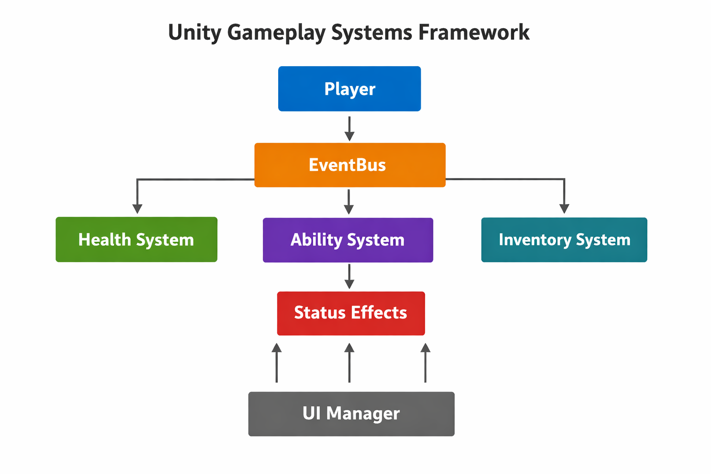

# Unity Gameplay Systems Framework

A modular gameplay architecture built in Unity demonstrating  
event-driven communication and decoupled gameplay systems.

## Features
- Event Bus communication
- Manual Composition Root (Bootstrapper)
- Strict Assembly Definition separation (Core, Gameplay, UI, Main)
- Memory-safe event resetting

## Systems Included
- Health System (Draining logic)
- Ability System (3-charge 20% Heal)
- Inventory System (10s Invincibility Potion)
- Status Effect System (System Intermediary)

## Architecture
The framework separates gameplay logic into modular assemblies. A central Bootstrapper in the Main assembly handles the manual wiring of dependencies (Inversion of Control) to ensure systems remain decoupled and testable.

## Folder Structure
Assets/Frameworks/Core
Assets/Frameworks/Gameplay
Assets/Frameworks/UI
Assets/Frameworks/Main





## Usage

### Casting an Ability

```csharp
var health = player.GetComponent<HealthComponent>();
statusEffectManager.Construct(health);
```

### Internal Flow

1. AbilityComponent or InventoryComponent raises a request via the EventBus.
2. The request is broadcast globally without a direct reference to the receiver.
3. The StatusEffectManager intercepts the event and applies logic to the injected HealthComponent.
4. The HealthComponent updates its state (Heal or Pause Drain) and broadcasts a change event.
5. The UIManager reacts to the change event to update the HUD and Slider.

### Benefits

-Decoupled gameplay systems
- Scalable architecture via asmdef
- Zero reliance on expensive "Find" or "Search" methods
- Easier debugging and memory safety via explicit initialization
